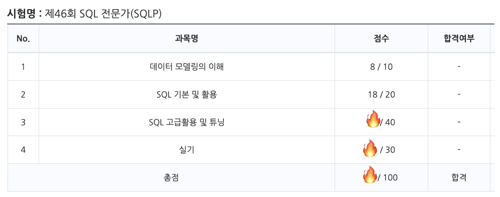

# 제46회 SQL 전문가(SQLP) 복기

## \[1] 응시 정보&#x20;

#### 응시명 : 제46회 SQL 전문가(SQLP)

#### 응시일자 : 2022년 09.04(일) 10:00

#### 준비 기간 : 2022년 7월 첫째주 \~ 2022년 8월 넷째주 (약 2개월)

## \[2] 개인적인 사담

* **발등에 불떨어진 회사 프로젝트 +  코로나가 풀려서 고된 노동이 되어버린 왕복 네시간 출퇴근**\
  **+ 점심 시간에 쪼개서 하는 SQLP기출 풀이 + 퇴근 직후 좀비 상태로 스터디카페가서 또 SQLP 공부 +수면부족**\
  **의 콜라보가 매일매일 반복된 상황에서**...\
  모든 심신이 지친 상태에서 시험에 응시하고나서 쓴 후기라 이번 후기는 짧다...
* 만약 46회에 낙방한다면 ... 47회때에는 더 개념을 선명하게 명확히 머리에 이고 문제를 좀 더 **유형화**하며 공부하면서 실전에 대비해야할 것 같다.\
  이번에두 마음에 확신이 안 선다. 참 쉽지 않은 시험이야 ! 덕분에 실무에서 쿼리로는 고수가 되었다.😎
* 이건 진짜진짜 사담이지만 ..ㅋㅋㅋ 시험시간이 10시 \~ 1시까지인데  10시 \~ 12시까지인줄알고\
  **12시까지 급하게 그냥 다 실기까지 풀어버렸다**....(진짜 지금 생각해보면 광기였던듯)\
  시간이 이상하게 너무 부족해서 진짜 눈물이 앞을 가리는 와중에도 문제는 다 풀고 나와야 직성이 풀릴것같아 \
  맘속으로 계속 저렇게 되뇌였다. 진짜 내 머릿속에 세포들이 흥분하고 무섭고 불안해서 난리도 아니었음...ㅠㅠ

> #### "유하..정신 똑바로 차리자 !!!!! 시간 부족해서 너가 당황해서 헤매는 시간에 한문제라도 더 풀 수 있어 !!!!!!!
>
> #### 정신차려 .... 할수있숴....할수있숴....후...침착해침착해..."

* 그 와중에 감독관한테 ..ㅠㅠ 왜 11시 55분인데 종료전 안내 안해주시냐고 떨리는 목소리로 물었는데....\
  당시 질문을 받은 감독관의 **당황+어처구니 없음**의 표정이 아직도 잊혀지지가 않는다.
  *   **" 시험 1시까지인데요..?;;"**

      <figure><figcaption>
 <strong>진짜 이런 표정이었음...</strong>
</figcaption></figure>

## \[3] 응시 후기 

### 1) ⭐️ 튜닝 문제 유형화하기 ( 객관식 , 주관식 모두 포함 ) 

* 문제 상황과 그에 따른 해결 방법을 case by case 로 묶어서 유형화하기
  * 문제 상황
    * 데이터 상황
      * 예를 들어 group by 절로 먼저 묶고 nl조인을 시도했지만 그 nl조인에 만족하는 데이터가 거의 없으면 group by절을 그냥 merge해서 처리한다던가..
    * 조회 조건 ( 전체 조회인지 부분범위처리 조회인지 )
    * 테이블 구성
      * 파티션인지 일반인지 : 파티션이면 그냥 full 스캔으로 처리할건지 인덱스를 사용할 건지
    * 인덱스 사용의 경우 조건절을 잘 태우고 있는지 : 형변환 처리
  * 튜닝 유형
    * select 튜닝
    * update 튜닝
    * insert 튜닝 : 보통 배치 튜닝에 많음
    * 대용량 배치 DML 튜닝
  * 그 외
    * unnest 세미조인으로 처리 등

### 2) 헷갈리는 기초 지식 정확히 하기 

* 정렬처리인 경우 Null값이 맨 앞으로 오는지 맨 뒤로 오는지
* 각 정규화 유형 (1차 정규화인지 2차 정규화인지..)

## **\[3]** 응시 결과

### 1) 결과 발표

#### 사전 공개 발표일시 : 2022년 09.23(금) 16:00

#### 결과는..... 합격 👍

<figure><figcaption>
 제46회 SQL 전문가(SQLP) 합격 
</figcaption></figure>

